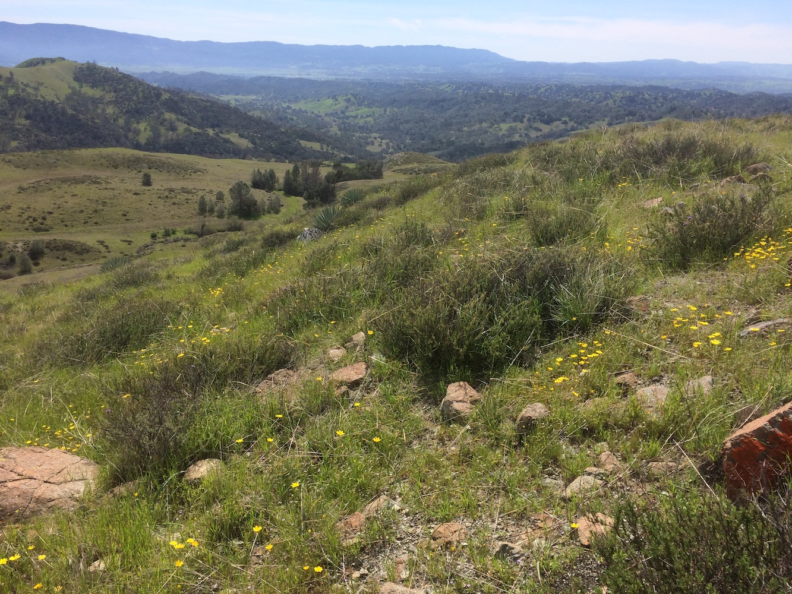

<!-- README.md is generated from README.Rmd. Please edit that file -->

# sedgwickenv

<!-- badges: start -->

<!-- badges: end -->

 **A view from the serpentine
habitats at Sedgwick**

## Overview:

This is an R data package with environmental characteristics of 24 study
sites located across the [University of California Sedgwick
Reserve](https://sedgwick.nrs.ucsb.edu/) in Santa Barbara County,
California. Data were collected by Nathan Kraft, Gaurav Kandlikar,
Andrew Kleinhesselink and the [Kraft Lab at
UCLA](https://sites.lifesci.ucla.edu/eeb-kraft/).

 **Sedgwick
Map:** A) Map of all 24 sites across the reserve–only the lower sites
are labeled. Sites labeled 740 to 763. B) Inset showing locations of
upper sites.
<!--sites mapped with the data-raw/map_sedgwick_ggmap.R script -->

## Installation

You can install this package from [GitHub](https://github.com/) with:

``` r
# install.packages("devtools")
devtools::install_github("akleinhesselink/sedgwickenv")
```

## Usage

`library(sedgwickenv)` will load the following datasets:

  - **sedgwick\_env**: dataframe with average environmental conditions
    at all 24 sites
  - **sedgwick\_ibutton**: daily Tmax, Tmin and Tavg spring temperatures
    at 24 sites
  - **sedgwick\_soil\_moisture**: spring soil moisture recorded at each
    of the 24 sites
  - **sedgwick\_boundary**: SpatialPolygon file showing boundaries of
    Sedgwick for maps
  - **sedgwick\_DEM**: raster showing elevation across Sedgwick at
    roughly 10 m resolution
  - **sedgwick\_soil\_depth**: soil depth recorded at each plot at each
    site
  - **sedgwick\_veg\_height**: vegetation height recorded at each plot
    at each site
